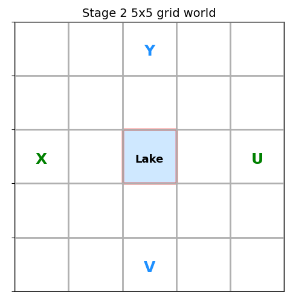
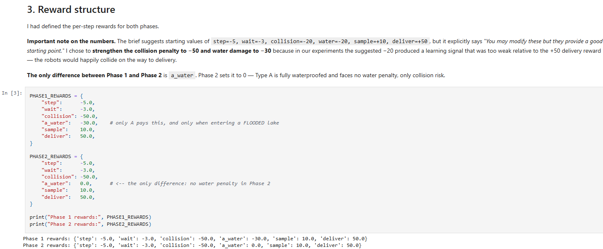
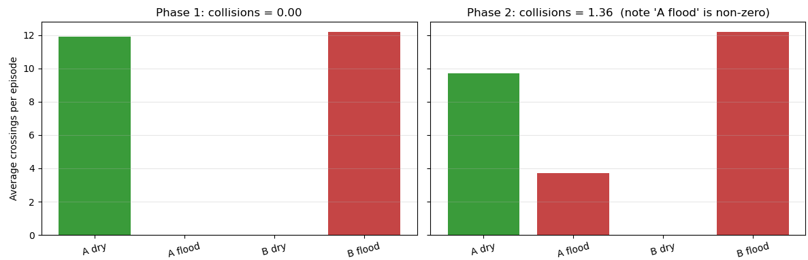
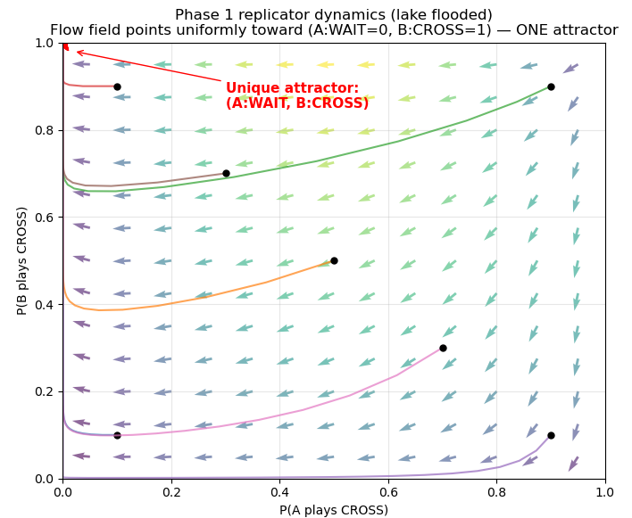
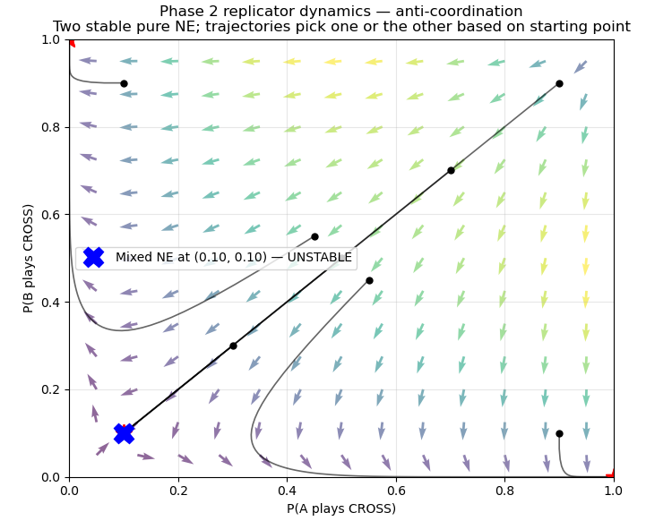

# Multi-Agent Reinforcement Learning for Cooperative Coordination

## Overview

This project explores how multiple intelligent agents can learn to cooperate, avoid conflicts, and make decisions in dynamic environments using Reinforcement Learning and Game Theory.

A custom grid-world environment was designed to study how agents adapt their behaviour under changing environmental conditions, reward structures, and interaction dynamics. The agents continuously learn through experience and gradually develop coordination strategies without being explicitly programmed.

The project combines concepts from multi-agent reinforcement learning, game theory, and adaptive decision-making to analyze emergent behaviours and equilibrium dynamics in distributed systems.

---

# Why This Matters

Many real-world autonomous systems do not operate in isolation. Self-driving vehicles, warehouse robots, delivery drones, and intelligent traffic systems must continuously coordinate with other agents while dealing with uncertainty and changing environments.

Understanding how cooperative behaviours emerge through learning is fundamental to building:

- Safer autonomous vehicles that can negotiate traffic efficiently.
- Multi-robot systems that coordinate tasks without collisions.
- Intelligent transportation and logistics systems that optimize resource usage.
- Distributed AI systems capable of making robust decisions in complex environments.

This project demonstrates how relatively simple learning rules can lead to sophisticated cooperative and adaptive behaviours, providing insights into the design of future autonomous systems.

---

# Key Features

- Independent **Tabular Q-Learning** agents.
- Custom **5×5 multi-agent environment** with dynamic constraints.
- Adaptive **reward shaping and penalty mechanisms**.
- Analysis of **cooperative and anti-coordination behaviours**.
- **Replicator Dynamics** and **Game-Theoretic** equilibrium analysis.
- Visualization of emergent coordination strategies and learning dynamics.

---

# Environment Setup

*Custom 5×5 grid environment used to study cooperative coordination and adaptive decision-making.*

---

# Reward Engineering

*Reward shaping and penalty design used to guide agent learning and encourage adaptive behaviours.*

---

# Collision Analysis

*Average collision analysis under different environmental conditions and reward structures.*

---

# Emergent Coordination Dynamics

### Phase 1 Dynamics

*Agents converge toward a unique cooperative equilibrium under flooded lake conditions.*

### Phase 2 Dynamics

*Environmental changes produce multiple stable equilibria and more complex coordination strategies.*

---

# Results and Achievements

- Demonstrated stable policy learning over **5,000+ training episodes**.
- Learned **collision avoidance** and **adaptive coordination strategies** under dynamic conditions.
- Showed how environmental changes significantly alter equilibrium behaviour and decision-making dynamics.
- Validated key concepts from **Reinforcement Learning** and **Game Theory** through practical simulations and visual analysis.

---

# Technologies Used

- Python
- Reinforcement Learning
- Tabular Q-Learning
- Multi-Agent Systems
- Game Theory
- NumPy
- Matplotlib
- Jupyter Notebook
